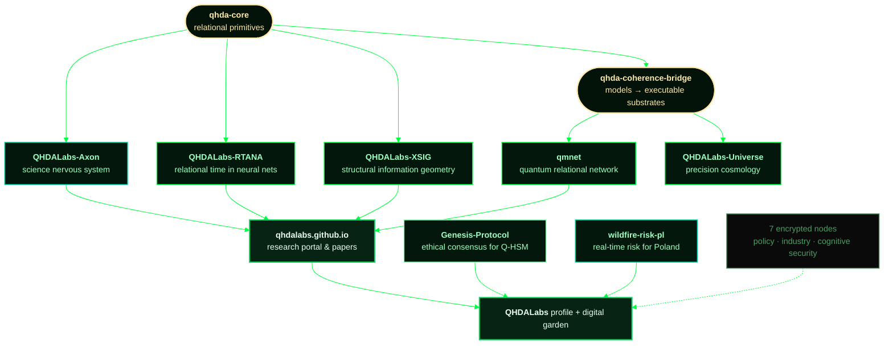

<div align="center">


<a href="https://qhdalabs.com">
  
</a>

<br/>


<br/>


</div>

## `▚` SESSION START

```console
root@qhdalabs:~$ whoami --verbose

  operator ......... Krzysztof Banasiewicz
  entity ........... QHDALabs — Strategic Futures Lab (independent deep-tech)
  location ......... Poland  ·  EU  ·  Global
  domains .......... quantum systems · applied AI · critical infrastructure · frontier science
  method ........... relation as the unit  ·  verification before discovery
  horizon .......... decades, not quarters
  portal ........... https://qhdalabs.com  ·  https://qhdalabs.github.io

root@qhdalabs:~$ cat /etc/mission

  Build and accelerate technologies that strengthen civilization,
  expand intelligence, and unlock new physical and computational frontiers.

root@qhdalabs:~$ _
```

> We operate where conventional boundaries end — combining **quantum science**, **AI systems**,
> **critical infrastructure**, **security engineering** and **large-scale strategic thinking**.

<div align="center"></div>

## `▚` THE CONSTRUCT — ecosystem topology



<div align="center"></div>

## `▚` ACTIVE NODES

<table>
<tr><th align="left">node</th><th align="left">what it is</th><th>stack</th><th>commits</th><th>online</th></tr>

<tr><td><a href="https://github.com/QHDALabs/QHDALabs-Axon"><b>QHDALabs-Axon</b></a></td>
<td>The <i>Science Nervous System</i> — relational infrastructure over the scientific literature. Relation as the unit, verification before discovery.</td>
<td></td>
<td align="center">37</td><td align="center">2026-06</td></tr>

<tr><td><a href="https://github.com/QHDALabs/QHDALabs-RTANA"><b>QHDALabs-RTANA</b></a></td>
<td>Relational Temporal Awareness in Neural Architectures — can a neural system have an internal relational clock? Page–Wootters × Rovelli × Qiskit.</td>
<td></td>
<td align="center">40</td><td align="center">2026-05</td></tr>

<tr><td><a href="https://github.com/QHDALabs/QHDALabs-XSIG"><b>QHDALabs-XSIG</b></a></td>
<td>Cross-cycle Structural Information Geometry.</td>
<td></td>
<td align="center">11</td><td align="center">2026-06</td></tr>

<tr><td><a href="https://github.com/QHDALabs/qmnet"><b>qmnet</b></a> ⭐</td>
<td>How much control do we have over <i>where</i> quantum information goes — and <i>when</i>?</td>
<td></td>
<td align="center">14</td><td align="center">2026-05</td></tr>

<tr><td><a href="https://github.com/QHDALabs/qhda-core"><b>qhda-core</b></a></td>
<td>The kernel. Relational primitives every other node imports.</td>
<td></td>
<td align="center">3</td><td align="center">2026-06</td></tr>

<tr><td><a href="https://github.com/QHDALabs/qhda-coherence-bridge"><b>qhda-coherence-bridge</b></a></td>
<td>Coherence-layer abstraction between relational quantum models and executable substrates. <b>Node #0</b> — where it all started.</td>
<td></td>
<td align="center">3</td><td align="center">2026-03</td></tr>

<tr><td><a href="https://github.com/QHDALabs/QHDALabs-Universe"><b>QHDALabs-Universe</b></a></td>
<td>Global Research Initiative for Precision Cosmology &amp; Emergent Systems.</td>
<td></td>
<td align="center">9</td><td align="center">2026-04</td></tr>

<tr><td><a href="https://github.com/QHDALabs/QHDALabs-Genesis-Protocol"><b>Genesis-Protocol</b></a></td>
<td>Open platform for crowdsourcing ethical consensus for the first Safe-by-Design Quantum Hardware Module (Q-HSM). Defining the <i>Golden Rule</i> for AI.</td>
<td></td>
<td align="center">23</td><td align="center">2026-05</td></tr>

<tr><td><a href="https://github.com/QHDALabs/QHDALabs-wildfire-risk-pl"><b>wildfire-risk-pl</b></a></td>
<td>Real-time wildfire risk prediction for Poland. The largest codebase in the lab — research that touches the ground.</td>
<td></td>
<td align="center">41</td><td align="center">2026-05</td></tr>

<tr><td><a href="https://github.com/QHDALabs/qhdalabs.github.io"><b>qhdalabs.github.io</b></a></td>
<td>Official research portal &amp; papers index → <a href="https://qhdalabs.github.io">live</a></td>
<td></td>
<td align="center">22</td><td align="center">2026-05</td></tr>

<tr><td><a href="https://github.com/QHDALabs/Multiverse-Theory"><b>Multiverse-Theory</b></a></td>
<td>Research fork focused on advanced cosmological models.</td>
<td></td>
<td align="center">48</td><td align="center">2026-04</td></tr>

<tr><td><a href="https://github.com/QHDALabs/QHDALabs"><b>QHDALabs</b></a></td>
<td>This node. Profile, ecosystem entry point &amp; the digital garden below.</td>
<td></td>
<td align="center">27</td><td align="center">2026-04</td></tr>
</table>

### `▚` ENCRYPTED NODES

```
  ┌────────────────────────────────────────────────────────────────────────┐
  │  9 private repositories · 2026-04 → 2026-07 · 71 commits               │
  │                                                                        │
  │  ██████████████  policy & regulatory engineering    [ CLASSIFIED ]     │
  │  ██████████████  industrial / energy systems        [ CLASSIFIED ]     │
  │  ██████████████  cognitive security research        [ CLASSIFIED ]     │
  │  ██████████████  transparency & governance tooling  [ CLASSIFIED ]     │
  │  ██████████████  floating research laboratory       [ CLASSIFIED ]     │
  │                                                                        │
  │  status: incubating — surfaces when it survives verification.          │
  └────────────────────────────────────────────────────────────────────────┘
```

<div align="center"></div>

## `▚` DIGITAL GARDEN

Ongoing research, thinking and technical documentation — grown in public.

| | |
|---|---|
| 🌱 [**Technical Blog**](./digital-garden/blog/) | Deep dives, essays and long-form articles — AGI futures, relational time, the knowledge conflict with AI. |
| 🔬 [**R&D Notes**](./digital-garden/research/) | [Quantum](./digital-garden/research/qhda-quantum/) (Qiskit) · [Relational](./digital-garden/research/qhda-relational/) (time emergence) · [Energy](./digital-garden/research/qhda-energy/) systems. |
| 📓 [**Knowledge Base**](./digital-garden/notes/) | Practical notes — ISO 27001, security architecture, perspectives on AGI partnership. |
| 📡 [**News**](./digital-garden/news/) | Project status, milestones, new nodes coming online. |

<div align="center"></div>

## `▚` SIGNAL ANALYSIS

Measured across **all 21 repositories** — public and private.

```text
LANGUAGE DISTRIBUTION                                            1.96 MB total
──────────────────────────────────────────────────────────────────────────────
Python       █████████████████████████████████████░░░░░░░░░░░░░   74.30 %  1458 KB
HTML         █████████░░░░░░░░░░░░░░░░░░░░░░░░░░░░░░░░░░░░░░░░░   18.68 %   367 KB
TeX          ██░░░░░░░░░░░░░░░░░░░░░░░░░░░░░░░░░░░░░░░░░░░░░░░░    3.19 %    63 KB
JavaScript   █░░░░░░░░░░░░░░░░░░░░░░░░░░░░░░░░░░░░░░░░░░░░░░░░░    2.10 %    41 KB
PowerShell   ▌░░░░░░░░░░░░░░░░░░░░░░░░░░░░░░░░░░░░░░░░░░░░░░░░░    0.92 %    18 KB
Shell        ▌░░░░░░░░░░░░░░░░░░░░░░░░░░░░░░░░░░░░░░░░░░░░░░░░░    0.48 %     9 KB
CSS          ▌░░░░░░░░░░░░░░░░░░░░░░░░░░░░░░░░░░░░░░░░░░░░░░░░░    0.25 %     5 KB
Make/Batch/Perl ░░░░░░░░░░░░░░░░░░░░░░░░░░░░░░░░░░░░░░░░░░░░░░░    0.07 %     1 KB
──────────────────────────────────────────────────────────────────────────────
nodes 21  ·  public 12  ·  encrypted 9  ·  commits 349  ·  uptime since 2026-02-25
```

```text
NODE GENESIS — first five months
──────────────────────────────────────────────────────────────────────────────
2026-02  ◦                  account genesis — the lab wakes up
2026-03  █                  1   qhda-coherence-bridge
2026-04  █████              5   Universe · Multiverse · QHDALabs · +2 encrypted
2026-05  █████              5   Genesis-Protocol · wildfire-risk-pl · qmnet
                                RTANA · qhdalabs.github.io
2026-06  ███                3   XSIG · qhda-core · Axon      ← the kernel lands
2026-07  ███████            7   all encrypted                ← the lab goes dark
──────────────────────────────────────────────────────────────────────────────
```

<div align="center">


</div>

<div align="center"></div>

## `▚` ARSENAL

<div align="center">


<br/><br/>


</div>

### Core domains

<table>
<tr>
<td width="25%" valign="top">

**⚛ Quantum**
- Architectures & algorithms
- Decoherence mitigation
- Hybrid quantum–classical
- Relational quantum mechanics

</td>
<td width="25%" valign="top">

**🧠 Artificial Intelligence**
- Autonomous reasoning
- Human–AI cooperation
- AI for industry & infra
- Strategic AI applications

</td>
<td width="25%" valign="top">

**🛡 Infrastructure**
- Critical infra modernization
- Cybersecurity architecture
- Industrial automation
- Energy & resilience

</td>
<td width="25%" valign="top">

**🔭 Frontier Science**
- Emergent spacetime
- Information-based physics
- Computational cosmology
- High-risk / high-reward

</td>
</tr>
</table>

<div align="center"></div>

## `▚` KOANS

> **`01`** &nbsp; *Do not bend the spoon. Bend the model until it predicts the spoon.*
>
> **`02`** &nbsp; *Verification before discovery. A result nobody can reproduce is a rumour with LaTeX.*
>
> **`03`** &nbsp; *Relation is the unit. The object is what remains when you forget the relations.*
>
> **`04`** &nbsp; *Sit with the problem long enough and it stops being a problem — it becomes structure.*
>
> **`05`** &nbsp; *Form is emptiness; emptiness is form. Both compile. Only one runs in production.*
>
> **`06`** &nbsp; *Think in decades. Ship on Tuesdays.*

<div align="center"></div>

## `▚` STRATEGIC VISION

The coming decades will be defined by the convergence of **quantum computation**, **artificial
intelligence**, **energy transformation**, **autonomous systems**, **space-scale engineering** and
**civilizational resilience**. Those who understand and integrate these domains early will help
define the next era.

**Long-term goals**

- Build globally relevant deep-tech IP
- Develop breakthrough quantum–AI systems
- Support resilient civilization-scale infrastructure
- Contribute to frontier science
- Create technologies worthy of the future

## `▚` ESTABLISH CONNECTION

QHDALabs welcomes collaboration with researchers, engineers, strategic institutions, investors,
visionary builders and frontier organizations.

<div align="center">

<a href="https://qhdalabs.com"></a>
<a href="https://qhdalabs.github.io"></a>
<a href="mailto:contact@qhdalabs.com"></a>
<a href="https://github.com/QHDALabs?tab=repositories"></a>

<br/><br/>


<sub><code>Phase 1: Foundation &amp; Public Buildout — this is only the beginning.</code></sub>

</div>
