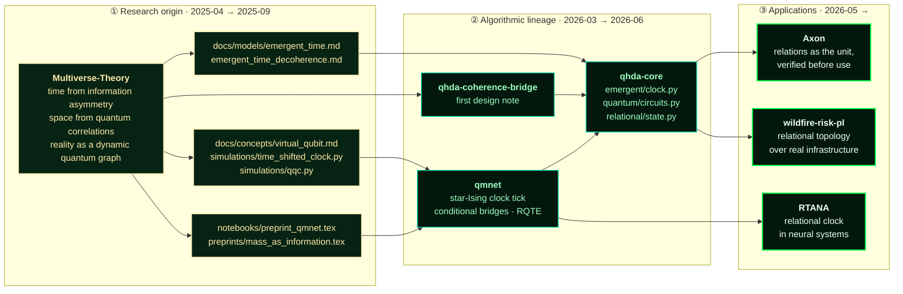
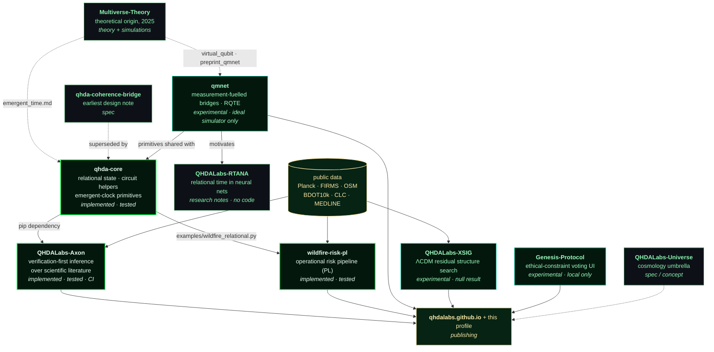

<div align="center">


</div>

# QHDALabs

**Independent research lab building verification-first tooling for relational quantum models,
scientific-literature inference, and applied environmental risk — with negative results published
alongside positive ones.**

Operator: Krzysztof W. Banasiewicz · Poland / EU · research indexed from 2025-04, public
repositories since 2026-02 · <contact@qhdalabs.com>

---

## Executive summary

QHDALabs is a one-person independent lab with **12 public repositories**, growing out of
theoretical work on time and space as emergent from quantum information, indexed publicly from
**April 2025** — a continuous line from that theory, through the algorithms it produced, into
applied systems (see [Research lineage](#research-lineage), whose chronology is provisional
pending a provenance reconstruction). The work spans three connected lines:
(1) *relational quantum models* — mid-circuit measurement used as a source of
conditional structure and emergent ordering (`qmnet`, `qhda-core`); (2) *verification-first
scientific inference* — a pipeline that tests candidate relations against explicit null models
before surfacing them (`QHDALabs-Axon`); (3) *applied risk systems* — an operational wildfire-risk
pipeline for Poland built on public satellite and geospatial data (`QHDALabs-wildfire-risk-pl`).

The distinguishing practice is methodological, not thematic: hypotheses are **pre-registered with
frozen statistics before results are seen**, tested against explicit nulls with multiple-testing
correction, and **stopped when they fail**. Three separate lines have produced published null or
failed results — a pre-registered held-out test that did not recover, a confirmatory tier that
failed its own contract and halted development, and a cosmological search that confirmed a null.
Those failures are documented in-repo with the numbers, and are the strongest evidence here that
the process is real.

**No result in this lab has been peer-reviewed, run on physical quantum hardware, or externally
validated.** Everything below is labelled with what it actually is.

<div align="center">


<sub>Every figure above is checkable against public files — see <a href="./docs/EVIDENCE.md">docs/EVIDENCE.md</a>. Regenerate: <code>python assets/gen_assets.py</code></sub>

</div>

---

## What exists today

Status vocabulary: **Implemented** (working code + tests) · **Experimental** (working code,
results from simulation or single runs, no test suite) · **Research notes** (written analysis, no
code) · **Spec** (design document only) · **Infrastructure** (publishing / tooling).

| Repository | What it is | Status | Directly verifiable evidence |
|---|---|---|---|
| [**QHDALabs-Axon**](https://github.com/QHDALabs/QHDALabs-Axon) | Verification-first inference over scientific literature. Two relation types with registered verifiers: lexical proximity (TF-IDF + empirical random-pair null + BH-FDR) and ABC bridge (Swanson closed discovery, two explicit nulls). | Implemented | 24 test modules, CI workflow, [`VERIFICATION_LOG.md`](https://github.com/QHDALabs/QHDALabs-Axon/blob/main/VERIFICATION_LOG.md), pre-registration docs in `docs/`, runnable corpora in `data/` |
| [**QHDALabs-wildfire-risk-pl**](https://github.com/QHDALabs/QHDALabs-wildfire-risk-pl) | Wildfire risk pipeline for Poland (v5: 33-node Lower Silesia forest-district graph). Ingests NASA FIRMS, OSM/Geofabrik, BDOT10k, CLC 2018; fuses ignition pressure, NDWI vegetation stress and topology into risk scores. | Implemented | `v5/` pytest suite, `v5/topology/*.json` outputs, SHAP reports, generated maps, two technical notes (PDF) |
| [**qhda-core**](https://github.com/QHDALabs/qhda-core) | Shared kernel: relational state, quantum circuit helpers, emergent-clock primitives. Consumed by Axon as a dependency. | Implemented | `src/qhda_core/`, `tests/test_integration.py`, `examples/wildfire_relational.py`, `pyproject.toml` |
| [**qmnet**](https://github.com/QHDALabs/qmnet) | Three Qiskit experiments: decoherence routing via ancilla coupling angle; measurement-fuelled conditional bridges in graph-state echo; RQTE, a 16-step construction where the key derives from an emergent measurement timeline. | Experimental | 4 runnable scripts, 2 technical notes (PDF), reported numbers reproducible on an ideal simulator in ~11 min total |
| [**QHDALabs-XSIG**](https://github.com/QHDALabs/QHDALabs-XSIG) | Search for non-random cross-channel structure in ΛCDM residuals (Planck 2018 TT, D/H, He-4, α dipole + King+2012 raw absorbers, eBOSS BAO). | Experimental | Real Planck data in `data/planck/`, run scripts, result plots — **published null result** |
| [**QHDALabs-Genesis-Protocol**](https://github.com/QHDALabs/QHDALabs-Genesis-Protocol) | React voting frontend for collecting ethical-constraint preferences intended for a safety-by-design hardware module. | Experimental (local only) | Source runs via `npm run dev`. **No public deployment exists.** Hardware module and vote ledger are conceptual. |
| [**QHDALabs-RTANA**](https://github.com/QHDALabs/QHDALabs-RTANA) | Question: can a neural architecture carry an internal relational clock rather than an external timestamp? | Research notes — **no code** | `MANIFESTO.md`, `QUESTIONS.md`, `RESEARCH_LOG.md`. Architecture, PoC and evaluation protocol are all unstarted. |
| [**QHDALabs-Universe**](https://github.com/QHDALabs/QHDALabs-Universe) | Umbrella for planned cosmology sub-projects (cosmoaudit, photon-engine, h0lab, reltime, cosmohub). | Spec / concept ("init alpha") | README only. No implementations, datasets or results. |
| [**qhda-coherence-bridge**](https://github.com/QHDALabs/qhda-coherence-bridge) | Earliest design note: abstraction layer between relational quantum models and executable substrates. | Spec | Design description only (~9 KB). Superseded in practice by `qhda-core`. |
| [**qhdalabs.github.io**](https://github.com/QHDALabs/qhdalabs.github.io) | Research portal and papers index → [live](https://qhdalabs.github.io) | Infrastructure | Deployed site |
| [**QHDALabs**](https://github.com/QHDALabs/QHDALabs) | This repository: profile, evidence documents, and the digital garden below. | Infrastructure | You are reading it |
| [**Multiverse-Theory**](https://github.com/QHDALabs/Multiverse-Theory) | **Research origin, earliest indexed 2025.** The theoretical work the lab grew out of: time from information asymmetry, space from quantum correlations, reality as a dynamic quantum graph. Self-fork of the operator's personal account, brought under QHDALabs in 2026-04. | Theory + simulations — predates the lab | ~40 concept/model documents in `docs/`, 6 Qiskit simulation scripts in `simulations/`, 3 preprint sources in `preprints/`, LaTeX build CI, `CITATION.cff` + `.zenodo.json`. See [lineage](#research-lineage) below. |

Licenses differ per repository (this one and `qmnet` are MIT; Axon is RCSAL v2.0). Check each repo.

**On private work.** Additional repositories are private. They are deliberately **not** offered as
evidence and no claims are made about them; nothing in this document depends on them. Everything
asserted above can be checked against public files today.

📄 Full claim-by-claim matrix: **[docs/EVIDENCE.md](./docs/EVIDENCE.md)** ·
Per-component status and roadmap: **[docs/PROJECT_STATUS.md](./docs/PROJECT_STATUS.md)**

---

## Research lineage

The lab is not a standing start. The implemented components descend from theoretical work whose
earliest **currently indexed** artifacts date to **April 2025**, ten months before the QHDALabs
account was created — a continuous line from theory, through algorithms, to applied systems.
Every arrow below is traceable to files.

> **Provisional — this chronology is a working version.** April 2025 is the earliest origin
> currently indexed in a public repository, not an established starting point. Earlier personal
> research artifacts exist that may belong to the same lineage and may predate it. A dedicated
> provenance reconstruction across the older archives is planned, to establish the earliest
> *defensible* origin of each line from actual files, dates and technical continuity. Until then
> this section deliberately neither shortens the history to 2025 nor claims older work that has
> not yet been shown to be continuous with it. The lineage links below are unaffected — they are
> file-to-file and stand on their own regardless of how far back the origin is ultimately dated.



| Origin artifact (2025) | Descendant | How to check the link |
|---|---|---|
| `docs/models/emergent_time.md`, `emergent_time_decoherence.md` | `qhda-core/src/qhda_core/emergent/clock.py` | The clock primitive implements the emergent-time model described in the 2025 documents |
| `docs/concepts/virtual_qubit.md`, `simulations/time_shifted_clock.py`, `simulations/qqc.py` | `qmnet` — the star-topology clock tick used in RQTE | Both use a star-topology model to derive a tick that distinguishes one step from another |
| `notebooks/preprint_qmnet.tex` / `.pdf` | [`qmnet`](https://github.com/QHDALabs/qmnet) | The qmnet preprint source sits in the theory repository — the bridge is a file, not a story |
| `docs/models/time_theory.md`, relational-time material | [`RTANA`](https://github.com/QHDALabs/QHDALabs-RTANA) | RTANA restates the relational-time question for neural architectures |
| `docs/models/topological_entanglement.md`, quantum-graph material | `qhda-core/relational/state.py` → Axon, wildfire graph topology | "Relation is the unit" is the shared thesis, applied to literature and to infrastructure |

**What this repository is and is not.** It is a self-fork of the operator's personal account
(`krzyshtoof/Multiverse-Theory`), brought under QHDALabs in April 2026; all commits are the
operator's own across both accounts. It contains theoretical documents, six Qiskit simulation
scripts and three preprint sources — **not peer-reviewed, and largely not experimentally tested.**
It is offered as the *provenance* of the algorithms, not as validation of them. The claims that
carry weight are the ones in the implemented components above, which can be run.

---

## The method: verification before discovery

The lab's operating rule is that a hypothesis is registered before it is tested, and a failure ends
the line rather than being quietly re-scoped. Four documented instances:

| Study | Pre-registered? | Outcome | Where |
|---|---|---|---|
| Axon `PROXIMITY` — 780 pairs from a 40-document arXiv corpus | Null model fixed in advance | **Null.** 34 nominally significant pairs; **0 survive BH-FDR at α=0.05.** Reported as the correct answer, not a failure. | [`VERIFICATION_LOG.md`](https://github.com/QHDALabs/QHDALabs-Axon/blob/main/VERIFICATION_LOG.md) |
| Axon `ABC_BRIDGE` — in-sample positive control (Swanson's Raynaud / fish-oil, 717 pre-1986 MeSH records) | Yes | **Recovered.** direct_sim = 0.046, mediated = 5.10, p_random = 0.0345. | same |
| Axon `ABC_BRIDGE` — pre-registered held-out case (migraine / magnesium), statistics frozen before the run | Yes | **Failed to recover** (p_random = 0.1214). Worse, a sibling literature (cluster headache, direct_sim = 0.283) would have been *falsely accepted* at q = 0.0135 — so the gate cannot separate siblings from true bridges. Documented rather than dropped. | same |
| Axon V2-A Tier-0 confirmatory, frozen pre-registration, R = 200, 11 cells | Yes | **Failed the contract cell** `thin_half_n4` (degradation 0.53 < 0.80 required). Latent-parent control passed. **Per protocol, development stopped; Tier 1 was never attempted.** | [`docs/ABC_BRIDGE_V2A_TIER0_PRE_REGISTRATION.md`](https://github.com/QHDALabs/QHDALabs-Axon/blob/main/docs/ABC_BRIDGE_V2A_TIER0_PRE_REGISTRATION.md) |
| XSIG — cross-channel structure in ΛCDM residuals, 500 bootstrap permutations | Positive control run first on synthetic injection (d ≈ 2.5, p < 0.0001) | **Null confirmed.** Best real-data test z = +1.29, p = 0.108; no test reached p < 0.05. Replacing the smooth α dipole model with raw King+2012 absorbers removed the apparent signal — i.e. the earlier hint was a model artifact, and this is stated. | [XSIG README](https://github.com/QHDALabs/QHDALabs-XSIG#readme) |

A comparable gate exists in the applied work: the wildfire pipeline **blocks fusion output when
layer coverage falls below 70% or fewer than three data sources are present**, and returns `null`
rather than a fabricated score.

The same rule applies to `qmnet`: the BUTTERFLY irreversibility class produced *lower* timeline
entropy (0.811 bit) than the other modes (≈1.0), which was the opposite of the expectation. It is
reported as an open question, not smoothed over.

---

## Architecture

Edges below are actual dependencies or documented derivations, not aspiration.



**Trust boundaries.** All external data enters through fetch scripts that pin and checksum what
they download (wildfire FIRMS downloads are validated atomically with SHA-256 across 73 five-day
windows for 2025). Quantum work runs on local Qiskit Aer simulators only — no cloud QPU
credentials are used anywhere in the public code. Genesis-Protocol calls an external LLM API and
World ID from the browser; it is a local prototype and must not be treated as a deployed system.

---

## Reproducing the work

Each repository is self-contained. The three fastest independent checks:

**1. Reproduce Axon's null result and its pre-registered failure** (~5 min):

```bash
git clone https://github.com/QHDALabs/QHDALabs-Axon && cd QHDALabs-Axon
pip install "git+https://github.com/QHDALabs/qhda-core.git" && pip install .
python examples/mvp_proximity_null.py      # expect: 0 relations survive BH-FDR
python examples/abc_bridge_recovery.py     # expect: Raynaud/fish-oil recovered, p_random≈0.0345
python examples/migraine_magnesium_heldout.py  # expect: NULL verdict, p_random≈0.1214
pytest
```

**2. Reproduce the quantum bridge and RQTE experiments** (~11 min, ideal simulator):

```bash
pip install "qiskit>=1.0" "qiskit-aer>=0.13" numpy scipy matplotlib
git clone https://github.com/QHDALabs/qmnet && cd qmnet
python qmnet_v3.py     # expect: P_ret = 0.000 at T=2,4 in the m=1 branch
python rqte_v3.py      # expect: correct decrypt in all 3 modes; BUTTERFLY entropy ≈0.811
```

**3. Run the wildfire pipeline without credentials** (stub mode, ~2 min):

```bash
git clone https://github.com/QHDALabs/QHDALabs-wildfire-risk-pl && cd QHDALabs-wildfire-risk-pl/v5
pip install -r requirements.txt
python qhdalabs_wildfire_ignition_v1.py --stub   # synthetic inputs, no API key needed
pytest
```

Live FIRMS ingestion needs a free NASA `FIRMS_MAP_KEY`. Two of the seven wildfire layers
(ARiMR LPIS, IBL KSIPL) have no automated source and must be imported manually — so a full
end-to-end run is **not** reproducible from a clean checkout without those files. This is a real
gap, stated rather than hidden.

---

## Limitations

Stated plainly, because an evaluator will find them anyway:

- **No peer review.** No output has been through external review or publication. The technical
  notes in `qmnet` and `wildfire-risk-pl` are self-published PDFs.
- **No physical quantum hardware.** Every quantum result is from a noise-free Qiskit Aer
  simulator. No noise model has been applied; no QPU run has happened. Scaling beyond 5 qubits is
  untested.
- **RQTE is not cryptography yet.** No security proof, no attacker model, no NIST SP 800-22
  randomness testing. It is a construction that encrypts and decrypts correctly in simulation.
- **Axon's bridge gate does not generalise.** It works for closed discovery in-sample and fails
  on the pre-registered held-out case and on sibling-literature separation. Development is halted
  at that boundary by design.
- **XSIG is limited by window count.** 16 observational windows is acknowledged as insufficient;
  shared instrumental systematics across the five channels cannot be excluded; BAO enters through
  a parametric model rather than raw data.
- **Wildfire validation is partial.** Coverage-gating and EFFIS comparison exist; there is no
  published skill score against a held-out fire season, and the pipeline covers one voivodeship.
- **Single operator, no institutional affiliation.** No lab partners, no funding, no external
  replication of any result.
- **Three repositories contain no code at all** (RTANA, Universe, coherence-bridge). They are
  labelled as such above.

---

## Roadmap

| Horizon | Work | Depends on |
|---|---|---|
| **Done** | Axon MVP pipeline + two verifiers + pre-registration protocol · wildfire v1→v5 · qmnet three experiments · XSIG null result · qhda-core extraction | — |
| **Now** | Axon: repair or replace the sibling-separation gate that failed Tier-0 · wildfire: skill scoring against a held-out season | Existing code |
| **Next** | NIST SP 800-22 on the RQTE keystream · qmnet under a realistic noise model · first QPU run (IBM Heron target) of the 4-step variant · extend wildfire beyond Lower Silesia | Compute + QPU access |
| **Research** | RTANA: turn the manifesto into an architecture proposal and a falsifiable evaluation protocol · XSIG with more observational windows · relational primitives as a shared substrate across the above | Open questions, not scheduled |

Nothing in the *Next* or *Research* rows is claimed to exist.

---

## Digital garden

Working notes and long-form write-ups, published as they are written.

| | |
|---|---|
| 🌱 [**Blog**](./digital-garden/blog/) | [RQTE v3.0 — when measurement creates time](./digital-garden/blog/blog-rqte-v3.md) (the full experimental write-up, including the result that went the wrong way) · [infrastructure notes](./digital-garden/blog/2026-05-21-genesis-digital-garden.md) · [AGI notes](./digital-garden/blog/2026-05-21-future-of-agi.md) |
| 🔬 [**Research notes**](./digital-garden/research/) | [Quantum](./digital-garden/research/qhda-quantum/) · [Relational time](./digital-garden/research/qhda-relational/) · [Energy](./digital-garden/research/qhda-energy/) |
| 📓 [**Knowledge base**](./digital-garden/notes/) | [ISO 27001 / ISMS practice notes](./digital-garden/notes/security-iso27001.md) |
| 📡 [**News**](./digital-garden/news/) | Release notes and status updates |

Published via GitHub Pages ([workflow](./.github/workflows/deploy.yml)) → [qhdalabs.github.io](https://qhdalabs.github.io)

---

## Domains and stack

**Python** (Qiskit · NumPy · SciPy · pandas · NetworkX · GeoPandas · scikit-learn/SHAP) ·
**JavaScript/React** · **TeX** · **GitHub Actions** · **GitHub Pages**

| Quantum & relational | Scientific inference | Applied risk systems | Security |
|---|---|---|---|
| Relational quantum mechanics (Rovelli, Page–Wootters) · mid-circuit measurement as conditional structure · decoherence routing · hybrid quantum–classical | Null-model design · multiple-testing correction · pre-registration · literature-based discovery (Swanson ABC) | Geospatial fusion · satellite ingestion (Sentinel-2 NDWI, FIRMS) · graph topology over infrastructure · explainability (SHAP) | ISMS / ISO 27001 practice · supply-chain hygiene (pinned, checksummed data fetches) |

---

## Collaboration

Open to collaboration with researchers, engineers, institutions and reviewers — particularly on
external replication, noise-model and QPU access for `qmnet`, and validation data for the wildfire
pipeline.

If you find an error in any result here, please open an issue on the relevant repository. Negative
findings about this work are as welcome as positive ones.

<div align="center">

<a href="https://qhdalabs.com"></a>
<a href="https://qhdalabs.github.io"></a>
<a href="mailto:contact@qhdalabs.com"></a>
<a href="https://github.com/QHDALabs?tab=repositories"></a>

</div>

---

<details>
<summary><b>Lab principles</b> — the working rules behind the method above</summary>

<br/>

> **`01`** &nbsp; *Do not bend the spoon. Bend the model until it predicts the spoon.*
>
> **`02`** &nbsp; *Verification before discovery. A result nobody can reproduce is a rumour with LaTeX.*
>
> **`03`** &nbsp; *Relation is the unit. The object is what remains when you forget the relations.*
>
> **`04`** &nbsp; *Sit with the problem long enough and it stops being a problem — it becomes structure.*
>
> **`05`** &nbsp; *Form is emptiness; emptiness is form. Both compile. Only one runs in production.*
>
> **`06`** &nbsp; *Think in decades. Ship on Tuesdays.*

These are not decoration. `02` is why `VERIFICATION_LOG.md` exists and why the Tier-0 failure
stopped development instead of being re-scoped. `03` is the shared thesis across `qhda-core`,
`qmnet` and `Axon`. `06` is why an operational wildfire pipeline sits next to cosmology.

**Long-term direction.** Quantum computation, machine intelligence, energy and infrastructure
resilience are converging. QHDALabs works at that intersection with a deliberately narrow method:
build the smallest verifiable thing, test it against an explicit null, publish what happened.
That direction is an intention, not a capability claim.

</details>

<div align="center">


<sub>MIT licensed (this repository) · © 2026 Krzysztof W. Banasiewicz</sub>

</div>
